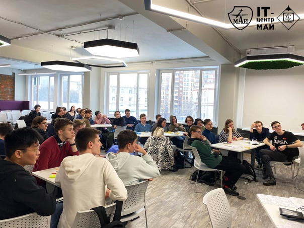
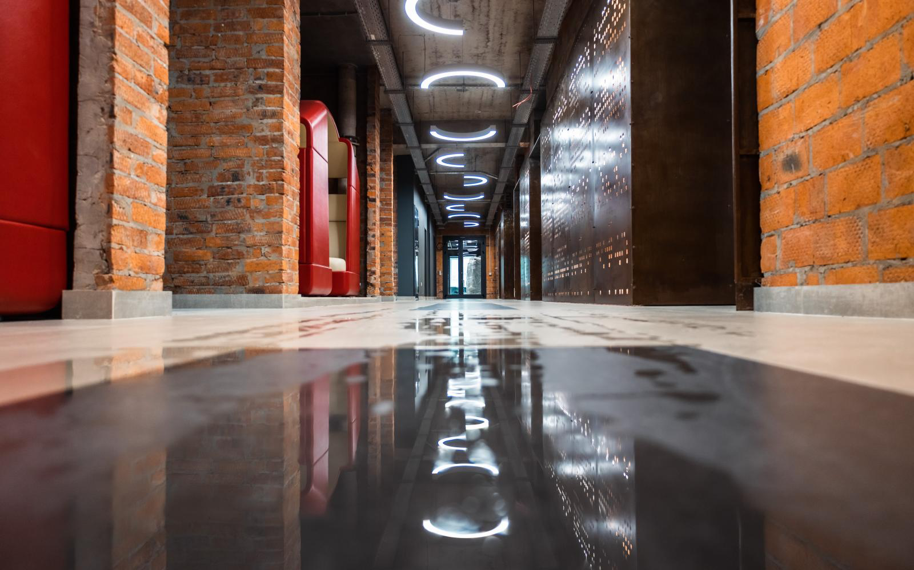

# MAI_FUTURE _XR

To contact the teamleader [smack](https://t.me/frog_without_rog_is_f "link to telegram")

## Project description

We are implementing a VR application to demonstrate the educational and technological conditions of the IT floor to applicants. This application will greatly simplify the procedure of familiarization with the university for people who, for one reason or another, cannot visit MAI in person (for example: due to the remoteness of their place of residence). In this application, you will be able to walk around a certain part of the 4th floor of the MAI, see the conditions that have been created for the training of students, and stroke the robot - Dora

## Important links
[Brief visualization of the project in MIRO](https://mir.com/app/board/uXjVPgpyb8w=)

[You can monitor the progress in Notion](https://www.notion.so/7aba2ef765b34600aee69606522dbde4?v=1df3c7407c044c1f98c979df3c2540fe)

## MAI's IT floor in reality

## MAI's IT floor in unity

